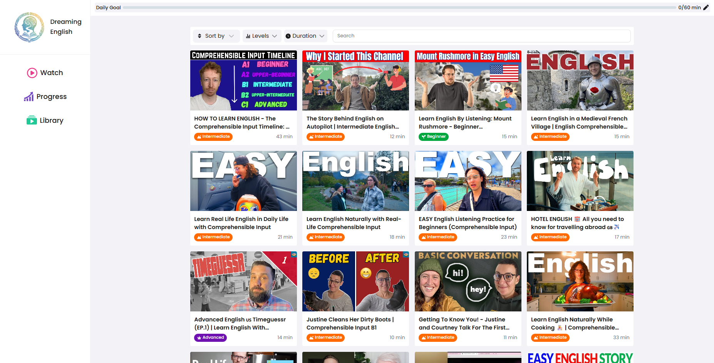

# Dreaming English

Learn English with interesting videos tailored for all levels. Master fluency through immersion.

**[Live Demo](https://dreamingenglish.vercel.app/)**



## What is Dreaming English?

Dreaming English is a platform inspired by DreamingSpanish that helps learners master English through engaging video content. It provides:
- Personalized learning paths based on proficiency levels
- Progress tracking with daily goals and streak counting
- AI-powered chat interactions for practice

## Problem & Motivation

Most learning platforms track content completion - a lesson is either finished or not.

However, immersion learning depends on time spent with understandable input rather than completed units.
Users may watch the same video partially, repeatedly, or across multiple sessions.

This means progress cannot be modeled as discrete actions.
It must behave like a continuous activity similar to exercise or habit tracking.

The main challenge is designing progress tracking that reflects real learning behavior instead of UI interactions.

## System Overview

The platform models learning as accumulated activity rather than completed tasks.

Progress is derived from watch time events instead of explicit user actions.
The client periodically reports activity, and the server calculates learning statistics from it.

The UI does not compute progress - it renders server-derived state.

This approach keeps behavior consistent across sessions and devices while keeping the system predictable.

## Product Overview

1. Sign up with Google/GitHub account or as a quest
2. Set daily goal (default - 15 minutes)
3. Browse videos
4. Watch videos progress updates automatically
5. Practice using AI chat
6. View progress

The platform focuses on building a consistent learning habit rather than completing lessons.

## Project Structure
The app follows **Feature-Sliced Design (FSD)** architecture for scalability and maintainability:
```
src/
├── app/          # Everything that makes the app run e.g. global styles, providers.
│
├── shared/       # Reusable utilities, hooks, types, UI components
│   ├── api/      # API client and data fetching
│   ├── hooks/    # Custom React hooks
│   ├── lib/      # Utility functions
│   ├── store/    # Zustand stores
│   ├── types/    # TypeScript types
│   └── ui/       # Reusable UI components
│
├── entities/     # Business entities (User, Video, Level, Message)
│   ├── User/
│   ├── Video/
│   ├── Level/
│   └── Message/
│   └── ...
│
├── features/     # Features (Auth, VideoPlayer, SendMessage)
│   ├── Auth/
│   ├── VideoPlayer/
│   ├── SendMessage/
│   ├── SetDailyGoal/
│   └── ...
│
├── widgets/      # Complex UI sections combining features
│   ├── Header/
│   ├── Sidebar/
│   ├── ChatWindow/
│   └── ...
│
└── pages/        # Page components (HomePage, BrowsePage, VideoPage)
    ├── HomePage/
    ├── BrowsePage/
    ├── VideoPage/
    └── ...
```

**Architecture Principles:**
- **Layers**: Shared → Entities → Features → Widgets → Pages
- **Isolation**: Each slice is independent and reusable
- **Scalability**: Easy to add new features without affecting existing code
- **Testability**: Clear boundaries make testing straightforward


## Core Features

### Authentication
- Login with Google/GitHub or as a guest

### Learning Management
- Track watch time per video
- Daily statistics and streaks
- Progress by proficiency level
- Video history
- AI conversation practice

### Content
- Videos at 4 levels: SUPER_BEGINNER → ADVANCED
- Search and filtering

## Key Backend Responsibilities
- accumulate watch time from heartbeat events
- derive daily progress and streaks
- store viewing history
- provide AI conversation endpoint

## Local Development

### Scripts
```bash
npm run dev              # Start dev server
npm run build            # Build for production
npm run lint             # Check code quality
npm run lint:fix         # Fix linting issues
npm run test:unit        # Run unit tests
npm run prisma:migrate   # Run migrations
```

### Tech Stack
- **Framework**: Next.js 16 + React 19
- **Database**: PostgreSQL + Prisma ORM
- **UI**:  Tailwind CSS 4 + Shadcn 
- **State Management**: Zustand + TanStack Query
- **Auth**: NextAuth.js
- **Video**: React Player
- **Virtualization**: TanStack React Virtual
- **Forms & Validation**: Zod
- **Icons**: Lucide React + React Icons
- **Testing**: Vitest + Playwright + React Testing Library
- **Monitoring**: Sentry + Vercel Speed Insights
- **Code Quality**: ESLint 9 + Prettier + TypeScript 5

### Code Quality
- ESLint for standards
- Prettier for formatting
- Husky for git hooks
- Pre-commit checks enabled


## License

See LICENSE file.


